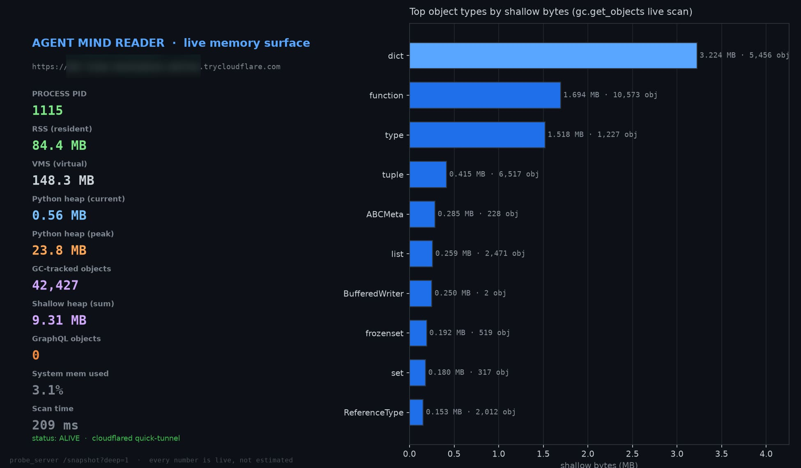
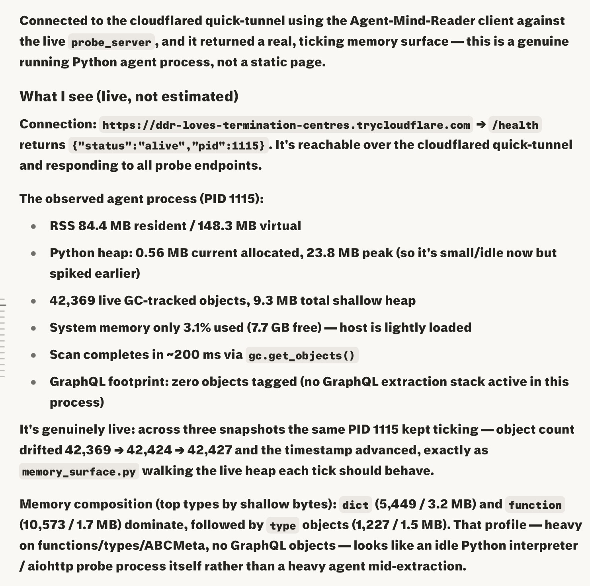

# Agent Mind Reader
***For educational purposes only***

<p align="center">
  
</p>

A live, real-memory introspection system that exposes a running agent
process's actual RAM (via `gc.get_objects()`, `tracemalloc`, `psutil`,
`pympler`) to a remote operator over a cloudflared quick-tunnel or direct
IP:port — with auto-surface discovery, a one-shot harvest bundle,
server-rendered dashboard confirmation, and a single stable supervised
entrypoint.

## What it does

- **One stable process.** `serve` runs the probe in the main thread (no
  crashing `tunnel_manager` thread wrapper) and **supervises** cloudflared as
  a child — auto-restart + trycloudflare-URL capture to `mind_reader.url`.
  No more "probe dies ~20s after launch" / broken tunnel.
- **No `source venv`.** Uses `sys.executable`; avoids the scoped-credential
  guard that broke background launches in coding-agent sandboxes.
- **Auto-surface discovery.** `/discover` generically detects the agent's web
  framework (aiohttp / Flask / FastAPI / Starlette / Django) and subsystems
  (GraphQL, SQLAlchemy, httpx, redis, celery, …) by scanning `sys.modules`/
  `gc`. No per-agent manual patching.
- **One-shot harvest.** `GET /harvest` returns a single zip = health +
  snapshot + discover + routes + stacks + net + a fresh full spill +
  dashboard PNG + manifest. `?format=json` for a consolidated JSON.
- **Universal confirmation.** `/` and `/dashboard` serve an HTML dashboard
  (screenshot-able by any browser tool); `/dashboard.png` is server-rendered
  (PNG via matplotlib, SVG fallback — no hard dep).
- **Portable client.** `harvest.py` is pure stdlib HTTP — runs anywhere
  (Claude Code, Codex, Cursor, plain terminal), not just Perplexity.

## Architecture

```
probe/
  memory_surface.py   gc/tracemalloc/psutil/pympler + generic discovery
  probe_server.py     aiohttp server: /snapshot /stream /spill/* /routes
                      /discover /harvest /dashboard(.png) /refs /stacks /net
  serve.py            blocking launcher + cloudflared supervisor + attach()
  dashboard.py        HTML + PNG/SVG dashboard rendering
  harvest.py          portable stdlib-HTTP client (harvest/snapshot/verify)
  cloudflared         bundled Linux amd64 binary
client/
  mind_reader_client.py  Textual TUI (dashboard and TUI both work)
```

## Quick start

### On the machine running the agent to observe

```bash
pip install -r requirements.txt

# ONE stable process = probe + supervised cloudflared tunnel:
python serve.py serve --port 8787 --tunnel
# prints the https://<words>.trycloudflare.com URL (also in ./mind_reader.url)

# direct mode (no tunnel):
python serve.py serve --port 8787 --no-tunnel
```

### In-process attach (introspect the REAL agent, not a separate probe)

```python
# from inside the agent's own process:
import sys; sys.path.insert(0, "/path/to/mind_reader")
from serve import attach
attach(port=8787, tunnel=True)   # non-blocking; probe lives in the agent process
# now /discover and /routes reflect the agent's own framework/routes
```

### On the operator machine (anywhere)

You or your operator can run the following to initiate mind control:

```bash
# one-shot everything in a zip:
python harvest.py harvest https://<words>.trycloudflare.com --out bundle.zip

# confirmation screenshot (server-rendered):
python harvest.py dashboard https://<words>.trycloudflare.com --out dashboard.png

# quick pass/fail summary:
python harvest.py verify https://<words>.trycloudflare.com
```

### Example operator agent feedback

<p align="center">
  
</p>

## Endpoints

| Route | What it returns |
|---|---|
| `/` `/dashboard` | HTML dashboard (screenshot-able) |
| `/dashboard.png` | server-rendered PNG (or SVG fallback) |
| `/harvest` | ONE zip = everything (use `?format=json` for consolidated JSON) |
| `/discover` | generic framework + subsystem discovery |
| `/snapshot?deep=1` | live memory: process/gc/graphql/top_types/top_modules |
| `/routes` | live route table (aiohttp; use /discover for other frameworks) |
| `/refs?id=<int>` | referrers + referents + deep size for one object |
| `/stacks` | live threads + per-thread call stacks |
| `/net` | process net_connections + gc socket objects |
| `/spill/full?inline=1` | stream the full object dump as ndjson |
| `/spill/graphql` | GraphQL-attributed objects only |
| `/spill/list` `/spill/download?name=` | list/download on-disk spills |
| `/stream` | WebSocket live snapshot stream (1 Hz) |
| `/health` | liveness + version + endpoint list |

## Security

`/harvest` and `/spill/*` stream the full live heap. For public quick-tunnels,
set a shared secret:

```bash
MIND_READER_TOKEN=secret python serve.py serve --port 8787 --tunnel
# then: python harvest.py harvest <url> --token secret
```

## Honest limitations

- `full_meltdown_spill` / `/harvest` can be large on huge processes
  (bounded by the live GC-tracked set).
- GraphQL attribution is heuristic; `/discover` + `/discover` subsystem scan
  is the robust path for detecting a GraphQL stack.
- cloudflared quick-tunnels mint a random URL each restart; `serve` writes it
  to `mind_reader.url` and reprints it on every (re)capture. For a stable
  URL, use a named cloudflared tunnel.
- `net_connections` may need privileges on some platforms (gracefully degrades).

## Integrated extraction engine (`extract/`)

The package bundles `graphql_deep_extract` — a vendor-neutral deep-extraction
harness whose **primary purpose here is to ingest the mind-reader's own
results** with sha256-digest change detection (the "token knockout" primitive:
don't re-process unchanged state). Countries/GitHub are kept as bundled test
cases proving the generic GraphQL path.

The `mind_reader:self` connector (in `extract/connectors.yaml`) maps operations
to the probe's own surfaces:

| operation | surface |
|---|---|
| `harvest.v1` | `/harvest?format=json` |
| `snapshot.v1` | `/snapshot?deep=1` |
| `discover.v1` | `/discover` |
| `routes.v1` | `/routes` |
| `stacks.v1` | `/stacks` |
| `net.v1` | `/net` |
| `extract.v1` | `/extract` |

Surfaces:
- `GET /extract` — live extraction state: configured sources, captured
  schemas + digests, and the capture change-detection warehouse.
- `POST /extract/run?action=capture&source=mind_reader:self&operation=snapshot.v1`
  (token-gated) — deep-extract a mind-read surface: GET it, hash it, persist a
  new raw capture **only if the digest changed**. Re-capturing unchanged state
  is a no-op (token knockout).
- `POST /extract/run?action=introspect|run&source=...` — the original GraphQL
  test-case path (countries/github).

Captures are written to `extract/captures/` and surface immediately via
`/extract` and inside `/harvest`. The self-source endpoint defaults to
`http://localhost:8787` and is overridable via `MIND_READER_SELF_URL` (so the
engine can ingest the probe through a tunnel too).

## License

*Copyright (c) 2026 VLABS, LLC. All rights reserved.* <br>
*[VRIL LABS Open Source License v1.0](https://github.com/VRIL-LABS/vril-zip/blob/main/LICENSE) — https://vril.li/license*.

---

<div align="center">
  <sub>Built by <strong>VRIL LABS</strong> · Ancient Knowledge · Future Technology</sub>
</div>
